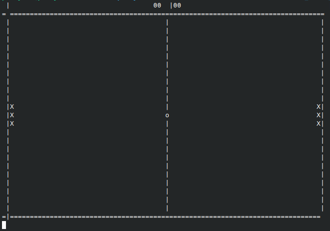
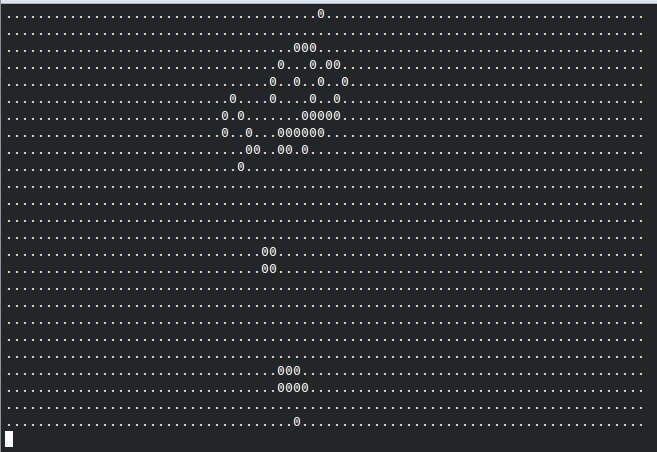
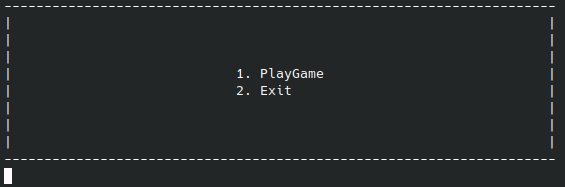
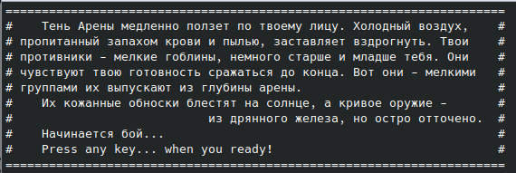
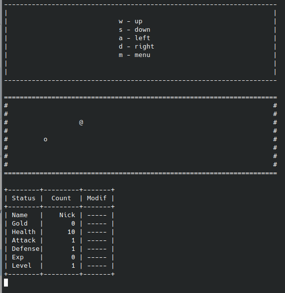

## Contents

1. [Chapter 1 - tennis](#chapter-i) \
    1.1. [Readme!](#readme)\
    1.2. [Level 1. Room 1.](#level-1-room-1)\
    1.3. [Level 1. Room 2.](#level-1-room-2)\
2. [Chapter 2 - life](#chapter-i) \
    2.1. [Level 2. Room 1.](#level-2-room-1)\
    2.2. [Level 2. Room 2.](#level-2-room-2)\
3. [Chapter 3 - goblins](#chapter-i) \
    3.1. [Level 3. Room 1.](#level-3-room-1)\
    3.2. [Level 3. Room 2.](#level-3-room-2)\

## Chapter 1 - tennis

## Readme!

\>
От разработчиков: \
Здравствуй, дорогой друг!

Первые работы во всём их совершенстве.

## Level 1. Room 1.

***LOADING Level 1…***
***LOADING Room 1…***

Перед вами пошаговый Теннис.

## Level 1. Room 2.

<h3 id="Commands" >Commands for tennis</h3>

<h4 id="left" >Левый игрок:</h4>
Вверх - sym != 'a'.\
Вниз - sym != 'z'.\
<h4 id="right" >Правый игрок:</h4>
Вверх - sym != 'k'.\
Вниз - sym != 'm'.\
<h4 id="other" >Другие команды:</h4>
Пропуск хода - sym != ' '.\
Окончание хода - sym = '\n'.\

## Chapter 2 - life

## Level 2. Room 1.

***LOADING Level 2…***
***LOADING Room 1…***

Перед вами игра Жизнь.

## Level 2. Room 2.

<h3 id="Commands" >Commands for life</h3>

Сборка: make

Очистка: make clean

Запуск(пример): ./play.out eaters.txt

## Chapter 3 - goblins

## Level 3. Room 1.

***LOADING Level 3…***
***LOADING Room 1…***

Перед вами игра Гоблины.

\

\

\

## Level 3. Room 2.

<h3 id="Commands" >Commands for goblins</h3>

Сборка: /make/make

Очистка: make /make/make clean

Запуск(пример): /build/GAME.exe

